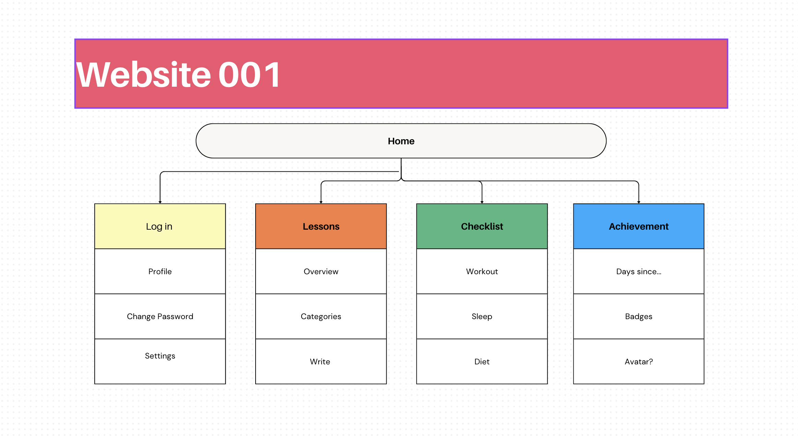

#  Midterm Project

## Idea
I want to create a website where I people can take a look back on their day and reflect on it.

Everyday just passes by without being able to rememeber any of it.

I want to craete a reflect section which users type a simple or complex lesson or reflection that they have achieved/learned today.

## Inspiration
- Home: Google.com or chatgpt.com

I want the homepage to be as simple as possible.

- Calendar: Notion Calendar

## Skills learned in class
- Navbar
- CSS
- DIV/ CLASS

## Skills needed to be learned
I have learned Databases and SQL in school and have utilized flask to create an interactive website. But I want to improve on my web dev skills futher so I will try to learn Django for SQL part of the website. I will also learn Javascript to create a nice website

## Sitemap

